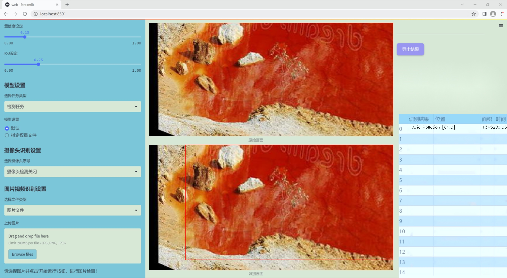
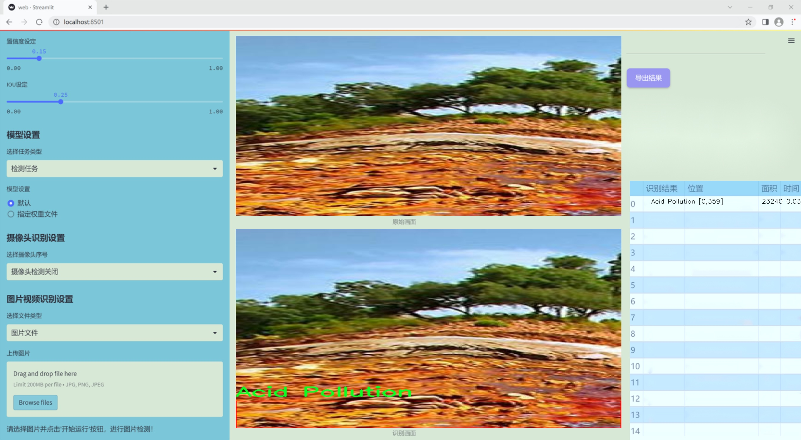
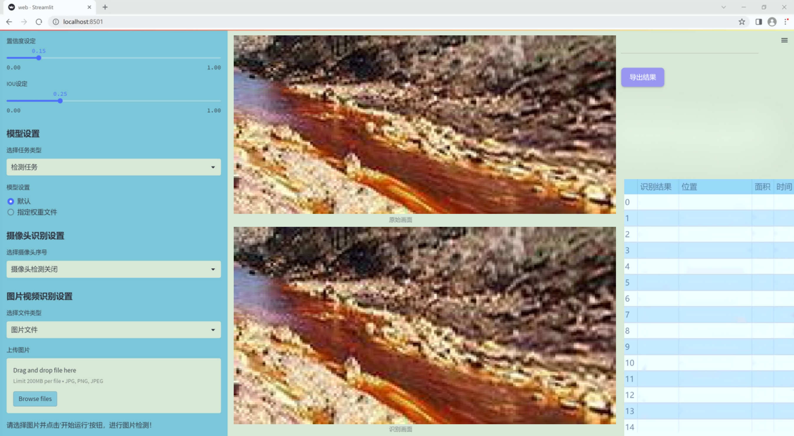
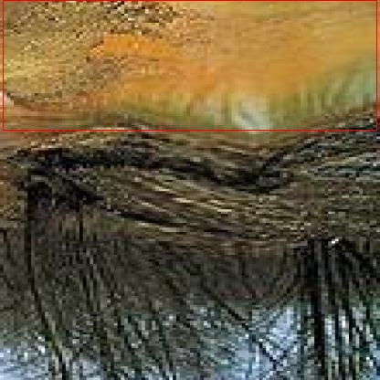
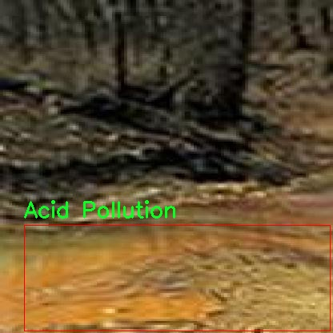
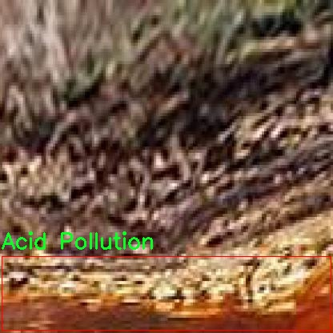
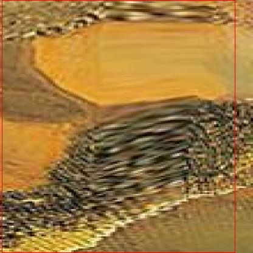
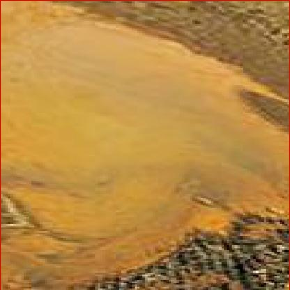

# 改进yolo11-ELA-HSFPN-TADDH等200+全套创新点大全：酸污染检测系统源码＆数据集全套

### 1.图片效果展示







##### 项目来源 **[人工智能促进会 2024.10.22](https://kdocs.cn/l/cszuIiCKVNis)**

##### 注意：由于项目一直在更新迭代，上面“1.图片效果展示”和“2.视频效果展示”展示的系统图片或者视频可能为老版本，新版本在老版本的基础上升级如下：（实际效果以升级的新版本为准）

  （1）适配了YOLOV11的“目标检测”模型和“实例分割”模型，通过加载相应的权重（.pt）文件即可自适应加载模型。

  （2）支持“图片识别”、“视频识别”、“摄像头实时识别”三种识别模式。

  （3）支持“图片识别”、“视频识别”、“摄像头实时识别”三种识别结果保存导出，解决手动导出（容易卡顿出现爆内存）存在的问题，识别完自动保存结果并导出到tempDir中。

  （4）支持Web前端系统中的标题、背景图等自定义修改。

  另外本项目提供训练的数据集和训练教程,暂不提供权重文件（best.pt）,需要您按照教程进行训练后实现图片演示和Web前端界面演示的效果。

### 2.视频效果展示

[2.1 视频效果展示](https://www.bilibili.com/video/BV1kDyJY1EiT/)

### 3.背景

研究背景与意义

随着工业化进程的加快，酸污染问题日益严重，给生态环境和人类健康带来了巨大的威胁。酸污染不仅影响土壤和水体的质量，还对生物多样性造成了显著的影响。因此，及时、准确地检测酸污染源，成为环境保护和治理的重要任务。传统的酸污染检测方法往往依赖于人工取样和实验室分析，效率低下且成本高昂，难以满足快速响应的需求。为此，基于计算机视觉和深度学习技术的自动化检测系统应运而生，成为解决这一问题的有效手段。

本研究旨在基于改进的YOLOv11模型，构建一个高效的酸污染检测系统。YOLO（You Only Look Once）系列模型以其实时性和高精度的特性，广泛应用于目标检测领域。通过对YOLOv11模型的改进，能够进一步提升其在复杂环境下的检测能力，尤其是在酸污染这一特定领域的应用。我们将利用一个包含49张图像的酸污染数据集，进行模型的训练和验证。该数据集专注于酸污染的特征，虽然样本数量较少，但通过数据增强和迁移学习等技术，可以有效提升模型的泛化能力。

本研究的意义在于，不仅为酸污染的监测提供了一种新颖的技术手段，还为相关领域的研究提供了基础数据和模型支持。通过建立高效的酸污染检测系统，能够实现对酸污染源的快速识别和定位，为环境治理提供科学依据，推动可持续发展目标的实现。同时，该系统的成功应用也为其他类型的环境污染检测提供了借鉴，具有广泛的推广价值。

### 4.数据集信息展示

##### 4.1 本项目数据集详细数据（类别数＆类别名）

nc: 1
names: ['Acid Pollution']


该项目为【目标检测】数据集，请在【训练教程和Web端加载模型教程（第三步）】这一步的时候按照【目标检测】部分的教程来训练

##### 4.2 本项目数据集信息介绍

本项目数据集信息介绍

本项目所使用的数据集名为“Acid Pollution”，旨在为改进YOLOv11的酸污染检测系统提供必要的训练数据。该数据集专注于酸污染的检测，涵盖了相关的图像和标注信息，以支持深度学习模型的训练和优化。数据集中包含的类别数量为1，具体类别为“Acid Pollution”，这意味着该数据集专注于识别和检测与酸污染相关的图像特征。

在数据集的构建过程中，研究团队通过多种渠道收集了大量的图像样本，这些样本展示了不同环境中酸污染的表现形式，包括工业排放、化学泄漏以及自然环境中的酸性物质影响等。每一幅图像都经过精心标注，确保能够准确反映酸污染的特征，为YOLOv11模型的训练提供高质量的输入数据。这种单一类别的设计，使得模型能够更加专注于酸污染的特征提取与识别，提升检测的准确性和效率。

此外，数据集还考虑到了多样性和代表性，包含了不同光照条件、角度和背景下的图像，以增强模型的泛化能力。通过对这些图像的分析和学习，YOLOv11将能够更好地适应各种实际应用场景，提升酸污染的检测能力。总之，“Acid Pollution”数据集为本项目提供了坚实的基础，助力于开发出更加高效和精准的酸污染检测系统。











### 5.全套项目环境部署视频教程（零基础手把手教学）

[5.1 所需软件PyCharm和Anaconda安装教程（第一步）](https://www.bilibili.com/video/BV1BoC1YCEKi/?spm_id_from=333.999.0.0&vd_source=bc9aec86d164b67a7004b996143742dc)


[5.2 安装Python虚拟环境创建和依赖库安装视频教程（第二步）](https://www.bilibili.com/video/BV1ZoC1YCEBw?spm_id_from=333.788.videopod.sections&vd_source=bc9aec86d164b67a7004b996143742dc)

### 6.改进YOLOv11训练教程和Web_UI前端加载模型教程（零基础手把手教学）

[6.1 改进YOLOv11训练教程和Web_UI前端加载模型教程（第三步）](https://www.bilibili.com/video/BV1BoC1YCEhR?spm_id_from=333.788.videopod.sections&vd_source=bc9aec86d164b67a7004b996143742dc)


按照上面的训练视频教程链接加载项目提供的数据集，运行train.py即可开始训练



     Epoch   gpu_mem       box       obj       cls    labels  img_size
     1/200     20.8G   0.01576   0.01955  0.007536        22      1280: 100%|██████████| 849/849 [14:42<00:00,  1.04s/it]
               Class     Images     Labels          P          R     mAP@.5 mAP@.5:.95: 100%|██████████| 213/213 [01:14<00:00,  2.87it/s]
                 all       3395      17314      0.994      0.957      0.0957      0.0843

     Epoch   gpu_mem       box       obj       cls    labels  img_size
     2/200     20.8G   0.01578   0.01923  0.007006        22      1280: 100%|██████████| 849/849 [14:44<00:00,  1.04s/it]
               Class     Images     Labels          P          R     mAP@.5 mAP@.5:.95: 100%|██████████| 213/213 [01:12<00:00,  2.95it/s]
                 all       3395      17314      0.996      0.956      0.0957      0.0845

     Epoch   gpu_mem       box       obj       cls    labels  img_size
     3/200     20.8G   0.01561    0.0191  0.006895        27      1280: 100%|██████████| 849/849 [10:56<00:00,  1.29it/s]
               Class     Images     Labels          P          R     mAP@.5 mAP@.5:.95: 100%|███████   | 187/213 [00:52<00:00,  4.04it/s]
                 all       3395      17314      0.996      0.957      0.0957      0.0845


###### [项目数据集下载链接](https://kdocs.cn/l/cszuIiCKVNis)

### 7.原始YOLOv11算法讲解


###### YOLOv11改进方向

与YOLOv 10相比，YOLOv 11有了巨大的改进，包括但不限于：

  * 增强的模型结构：模型具有改进的模型结构，以获取图像处理并形成预测
  * GPU优化：这是现代ML模型的反映，GPU训练ML模型在速度和准确性上都更好。
  * 速度：YOLOv 11模型现在经过增强和GPU优化以用于训练。通过优化，这些模型比它们的前版本快得多。在速度上达到了25%的延迟减少！
  * 更少的参数：更少的参数允许更快的模型，但v11的准确性不受影响
  * 更具适应性：更多支持的任务YOLOv 11支持多种类型的任务、多种类型的对象和多种类型的图像。

###### YOLOv11功能介绍

Glenn Jocher和他的团队制作了一个令人敬畏的YOLOv 11迭代，并且在图像人工智能的各个方面都提供了YOLO。YOLOv 11有多种型号，包括：

  * 对象检测-在训练时检测图像中的对象
  * 图像分割-超越对象检测，分割出图像中的对象
  * 姿态检测-当用点和线训练时绘制一个人的姿势
  * 定向检测（OBB）：类似于对象检测，但包围盒可以旋转
  * 图像分类-在训练时对图像进行分类

使用Ultralytics Library，这些模型还可以进行优化，以：

  * 跟踪-可以跟踪对象的路径
  * 易于导出-库可以以不同的格式和目的导出
  * 多场景-您可以针对不同的对象和图像训练模型

此外，Ultralytics还推出了YOLOv 11的企业模型，该模型将于10月31日发布。这将与开源的YOLOv
11模型并行，但将拥有更大的专有Ultralytics数据集。YOLOv 11是“建立在过去的成功”的其他版本的之上。

###### YOLOv11模型介绍

YOLOv 11附带了边界框模型（无后缀），实例分割（-seg），姿态估计（-pose），定向边界框（-obb）和分类（-cls）。

这些也有不同的尺寸：纳米（n），小（s），中（m），大（l），超大（x）。


YOLOv11模型

###### YOLOv11与前版本对比

与YOLOv10和YOLOv8相比，YOLOv11在Ultralytics的任何帖子中都没有直接提到。所以我会收集所有的数据来比较它们。感谢Ultralytics：

**检测：**


YOLOv11检测统计


YOLOv10检测统计

其中，Nano的mAPval在v11上为39.5，v10上为38.5；Small为47.0 vs 46.3，Medium为51.5 vs
51.1，Large为53.4 vs 53.2，Extra Large为54.7vs
54.4。现在，这可能看起来像是一种增量增加，但小小数的增加可能会对ML模型产生很大影响。总体而言，YOLOv11以0.3
mAPval的优势追平或击败YOLOv10。

现在，我们必须看看速度。在延迟方面，Nano在v11上为1.55 , v10上为1.84，Small为2.46 v2.49，Medium为4.70
v4.74，Large为6.16 v7.28，Extra Large为11.31
v10.70。延迟越低越好。YOLOv11提供了一个非常低的延迟相比，除了特大做得相当差的前身。

总的来说，Nano模型是令人振奋的，速度更快，性能相当。Extra Large在性能上有很好的提升，但它的延迟非常糟糕。

**分割：**


YOLOV11 分割统计


YOLOV9 分割统计


YOLOV8 分割数据

总体而言，YOLOv 11上的分割模型在大型和超大型模型方面比上一代YOLOv 8和YOLOv 9做得更好。

YOLOv 9 Segmentation没有提供任何关于延迟的统计数据。比较YOLOv 11延迟和YOLOv 8延迟，发现YOLOv 11比YOLOv
8快得多。YOLOv 11将大量GPU集成到他们的模型中，因此期望他们的模型甚至比CPU测试的基准更快！

姿态估计：


YOLOV11姿态估计统计


YOLOV8姿态估计统计

YOLOv 11的mAP 50 -95统计量也逐渐优于先前的YOLOv 8（除大型外）。然而，在速度方面，YOLOv
11姿势可以最大限度地减少延迟。其中一些延迟指标是版本的1/4！通过对这些模型进行GPU训练优化，我可以看到指标比显示的要好得多。

**定向边界框：**


YOLOv11 OBB统计


YOLOv8 OBB统计

OBB统计数据在mAP
50上并不是很好，只有非常小的改进，在某种程度上小于检测中的微小改进。然而，从v8到v11的速度减半，这表明YOLOv11在速度上做了很多努力。

**最后，分类：**


YOLOv 11 CLS统计


YOLOv8 CLS统计

从v8到v11，准确性也有了微小的提高。然而，速度大幅上升，CPU速度更快的型号。


### 8.200+种全套改进YOLOV11创新点原理讲解

#### 8.1 200+种全套改进YOLOV11创新点原理讲解大全

由于篇幅限制，每个创新点的具体原理讲解就不全部展开，具体见下列网址中的改进模块对应项目的技术原理博客网址【Blog】（创新点均为模块化搭建，原理适配YOLOv5~YOLOv11等各种版本）

[改进模块技术原理博客【Blog】网址链接](https://gitee.com/qunmasj/good)


#### 8.2 精选部分改进YOLOV11创新点原理讲解

###### 这里节选部分改进创新点展开原理讲解(完整的改进原理见上图和[改进模块技术原理博客链接](https://gitee.com/qunmasj/good)【如果此小节的图加载失败可以通过CSDN或者Github搜索该博客的标题访问原始博客，原始博客图片显示正常】

### MS-Block简介
实时目标检测，以YOLO系列为例，已在工业领域中找到重要应用，特别是在边缘设备（如无人机和机器人）中。与之前的目标检测器不同，实时目标检测器旨在在速度和准确性之间追求最佳平衡。为了实现这一目标，提出了大量的工作：从第一代DarkNet到CSPNet，再到最近的扩展ELAN，随着性能的快速增长，实时目标检测器的架构经历了巨大的变化。

尽管性能令人印象深刻，但在不同尺度上识别对象仍然是实时目标检测器面临的基本挑战。这促使作者设计了一个强大的编码器架构，用于学习具有表现力的多尺度特征表示。具体而言，作者从两个新的角度考虑为实时目标检测编码多尺度特征：

从局部视角出发，作者设计了一个具有简单而有效的分层特征融合策略的MS-Block。受到Res2Net的启发，作者在MS-Block中引入了多个分支来进行特征提取，但不同的是，作者使用了一个带有深度卷积的 Inverted Bottleneck Block块，以实现对大Kernel的高效利用。

从全局视角出发，作者提出随着网络加深逐渐增加卷积的Kernel-Size。作者在浅层使用小Kernel卷积来更高效地处理高分辨率特征。另一方面，在深层中，作者采用大Kernel卷积来捕捉广泛的信息。

基于以上设计原则，作者呈现了作者的实时目标检测器，称为YOLO-MS。为了评估作者的YOLO-MS的性能，作者在MS COCO数据集上进行了全面的实验。还提供了与其他最先进方法的定量比较，以展示作者方法的强大性能。如图1所示，YOLO-MS在计算性能平衡方面优于其他近期的实时目标检测器。


具体而言，YOLO-MS-XS在MS COCO上获得了43%+的AP得分，仅具有450万个可学习参数和8.7亿个FLOPs。YOLO-MS-S和YOLO-MS分别获得了46%+和51%+的AP，可学习参数分别为810万和2220万。此外，作者的工作还可以作为其他YOLO模型的即插即用模块。通常情况下，作者的方法可以将YOLOv11的AP从37%+显著提高到40%+，甚至还可以使用更少的参数和FLOPs。

CSP Block是一个基于阶段级梯度路径的网络，平衡了梯度组合和计算成本。它是广泛应用于YOLO系列的基本构建块。已经提出了几种变体，包括YOLOv4和YOLOv11中的原始版本，Scaled YOLOv4中的CSPVoVNet，YOLOv11中的ELAN，以及RTMDet中提出的大Kernel单元。作者在图2(a)和图2(b)中分别展示了原始CSP块和ELAN的结构。


上述实时检测器中被忽视的一个关键方面是如何在基本构建块中编码多尺度特征。其中一个强大的设计原则是Res2Net，它聚合了来自不同层次的特征以增强多尺度表示。然而，这一原则并没有充分探索大Kernel卷积的作用，而大Kernel卷积已经在基于CNN的视觉识别任务模型中证明有效。将大Kernel卷积纳入Res2Net的主要障碍在于它们引入的计算开销，因为构建块采用了标准卷积。在作者的方法中，作者提出用 Inverted Bottleneck Block替代标准的3 × 3卷积，以享受大Kernel卷积的好处。

#### MS-Block

基于前面的分析，参考该博客提出了一个带有分层特征融合策略的全新Block，称为MS-Block，以增强实时目标检测器在提取多尺度特征时的能力，同时保持快速的推理速度。

MS-Block的具体结构如图2(c)所示。假设是输入特征。通过1×1卷积的转换后，X的通道维度增加到n*C。然后，作者将X分割成n个不同的组，表示为，其中。为了降低计算成本，作者选择n为3。

注意，除了之外，每个其他组都经过一个 Inverted Bottleneck Block层，用表示，其中k表示Kernel-Size，以获得。的数学表示如下：


根据这个公式，作者不将 Inverted Bottleneck Block层连接到，使其作为跨阶段连接，并保留来自前面层的信息。最后，作者将所有分割连接在一起，并应用1×1卷积来在所有分割之间进行交互，每个分割都编码不同尺度的特征。当网络加深时，这个1×1卷积也用于调整通道数。

#### Heterogeneous Kernel Selection Protocol
除了构建块的设计外，作者还从宏观角度探讨了卷积的使用。之前的实时目标检测器在不同的编码器阶段采用了同质卷积（即具有相同Kernel-Size的卷积），但作者认为这不是提取多尺度语义信息的最佳选项。

在金字塔结构中，从检测器的浅阶段提取的高分辨率特征通常用于捕捉细粒度语义，将用于检测小目标。相反，来自网络较深阶段的低分辨率特征用于捕捉高级语义，将用于检测大目标。如果作者在所有阶段都采用统一的小Kernel卷积，深阶段的有效感受野（ERF）将受到限制，影响大目标的性能。在每个阶段中引入大Kernel卷积可以帮助解决这个问题。然而，具有大的ERF的大Kernel可以编码更广泛的区域，这增加了在小目标外部包含噪声信息的概率，并且降低了推理速度。

在这项工作中，作者建议在不同阶段中采用异构卷积，以帮助捕获更丰富的多尺度特征。具体来说，在编码器的第一个阶段中，作者采用最小Kernel卷积，而最大Kernel卷积位于最后一个阶段。随后，作者逐步增加中间阶段的Kernel-Size，使其与特征分辨率的增加保持一致。这种策略允许提取细粒度和粗粒度的语义信息，增强了编码器的多尺度特征表示能力。

正如图所示，作者将k的值分别分配给编码器中的浅阶段到深阶段，取值为3、5、7和9。作者将其称为异构Kernel选择（HKS）协议。


作者的HKS协议能够在深层中扩大感受野，而不会对浅层产生任何其他影响。第4节的图4支持了作者的分析。此外，HKS不仅有助于编码更丰富的多尺度特征，还确保了高效的推理。

如表1所示，将大Kernel卷积应用于高分辨率特征会产生较高的计算开销。然而，作者的HKS协议在低分辨率特征上采用大Kernel卷积，从而与仅使用大Kernel卷积相比，大大降低了计算成本。


在实践中，作者经验性地发现，采用HKS协议的YOLO-MS的推理速度几乎与仅使用深度可分离的3 × 3卷积相同。


如图所示，作者模型的Backbone由4个阶段组成，每个阶段后面跟随1个步长为2的3 × 3卷积进行下采样。在第3个阶段后，作者添加了1个SPP块，与RTMDet中一样。在作者的编码器上，作者使用PAFPN作为Neck来构建特征金字塔[31, 35]。它融合了从Backbone不同阶段提取的多尺度特征。Neck中使用的基本构建块也是作者的MS-Block，在其中使用3 × 3深度可分离卷积进行快速推理。

此外，为了在速度和准确性之间取得更好的平衡，作者将Backbone中多级特征的通道深度减半。作者提供了3个不同尺度的YOLO-MS变体，即YOLO-MS-XS、YOLO-MS-S和YOLO-MS。不同尺度的YOLO-MS的详细配置列在表2中。对于YOLO-MS的其他部分，作者将其保持与RTMDet相同。


### 9.系统功能展示

图9.1.系统支持检测结果表格显示

  图9.2.系统支持置信度和IOU阈值手动调节

  图9.3.系统支持自定义加载权重文件best.pt(需要你通过步骤5中训练获得)

  图9.4.系统支持摄像头实时识别

  图9.5.系统支持图片识别

  图9.6.系统支持视频识别

  图9.7.系统支持识别结果文件自动保存

  图9.8.系统支持Excel导出检测结果数据


### 10. YOLOv11核心改进源码讲解

#### 10.1 fasternet.py

以下是对给定代码的核心部分进行分析和详细注释的结果。我们将保留与模型结构和前向传播相关的核心代码，并对其进行中文注释。

```python
import torch
import torch.nn as nn
from typing import List
from torch import Tensor

class Partial_conv3(nn.Module):
    """部分卷积层，用于处理输入的部分通道。"""

    def __init__(self, dim, n_div, forward):
        super().__init__()
        self.dim_conv3 = dim // n_div  # 计算部分卷积的通道数
        self.dim_untouched = dim - self.dim_conv3  # 计算未被卷积处理的通道数
        self.partial_conv3 = nn.Conv2d(self.dim_conv3, self.dim_conv3, 3, 1, 1, bias=False)  # 定义卷积层

        # 根据前向传播的方式选择相应的函数
        if forward == 'slicing':
            self.forward = self.forward_slicing
        elif forward == 'split_cat':
            self.forward = self.forward_split_cat
        else:
            raise NotImplementedError

    def forward_slicing(self, x: Tensor) -> Tensor:
        """仅用于推理阶段的前向传播。"""
        x = x.clone()  # 保持原始输入不变，以便后续的残差连接
        x[:, :self.dim_conv3, :, :] = self.partial_conv3(x[:, :self.dim_conv3, :, :])  # 对部分通道进行卷积

        return x

    def forward_split_cat(self, x: Tensor) -> Tensor:
        """用于训练和推理阶段的前向传播。"""
        x1, x2 = torch.split(x, [self.dim_conv3, self.dim_untouched], dim=1)  # 将输入分为两部分
        x1 = self.partial_conv3(x1)  # 对第一部分进行卷积
        x = torch.cat((x1, x2), 1)  # 将两部分拼接在一起

        return x


class MLPBlock(nn.Module):
    """多层感知机块，用于特征转换。"""

    def __init__(self, dim, n_div, mlp_ratio, drop_path, layer_scale_init_value, act_layer, norm_layer, pconv_fw_type):
        super().__init__()
        self.dim = dim
        self.mlp_ratio = mlp_ratio
        self.drop_path = nn.Identity() if drop_path <= 0 else DropPath(drop_path)  # 根据drop_path值选择相应的操作
        self.n_div = n_div

        mlp_hidden_dim = int(dim * mlp_ratio)  # 计算隐藏层的维度

        # 定义多层感知机的结构
        mlp_layer: List[nn.Module] = [
            nn.Conv2d(dim, mlp_hidden_dim, 1, bias=False),
            norm_layer(mlp_hidden_dim),
            act_layer(),
            nn.Conv2d(mlp_hidden_dim, dim, 1, bias=False)
        ]

        self.mlp = nn.Sequential(*mlp_layer)  # 将MLP层组合成一个序列

        # 初始化空间混合层
        self.spatial_mixing = Partial_conv3(dim, n_div, pconv_fw_type)

        # 如果层缩放初始化值大于0，则使用层缩放
        if layer_scale_init_value > 0:
            self.layer_scale = nn.Parameter(layer_scale_init_value * torch.ones((dim)), requires_grad=True)
            self.forward = self.forward_layer_scale  # 使用带层缩放的前向传播
        else:
            self.forward = self.forward  # 使用默认的前向传播

    def forward(self, x: Tensor) -> Tensor:
        """前向传播函数。"""
        shortcut = x  # 保存输入以便进行残差连接
        x = self.spatial_mixing(x)  # 进行空间混合
        x = shortcut + self.drop_path(self.mlp(x))  # 残差连接
        return x

    def forward_layer_scale(self, x: Tensor) -> Tensor:
        """带层缩放的前向传播函数。"""
        shortcut = x
        x = self.spatial_mixing(x)
        x = shortcut + self.drop_path(self.layer_scale.unsqueeze(-1).unsqueeze(-1) * self.mlp(x))  # 残差连接与层缩放
        return x


class FasterNet(nn.Module):
    """FasterNet模型，包含多个阶段和特征提取模块。"""

    def __init__(self, in_chans=3, num_classes=1000, embed_dim=96, depths=(1, 2, 8, 2), mlp_ratio=2., n_div=4,
                 patch_size=4, patch_stride=4, patch_size2=2, patch_stride2=2, patch_norm=True,
                 drop_path_rate=0.1, layer_scale_init_value=0, norm_layer='BN', act_layer='RELU', pconv_fw_type='split_cat'):
        super().__init__()

        # 选择归一化层和激活函数
        norm_layer = nn.BatchNorm2d if norm_layer == 'BN' else NotImplementedError
        act_layer = nn.GELU if act_layer == 'GELU' else partial(nn.ReLU, inplace=True)

        self.num_stages = len(depths)  # 计算阶段数量
        self.embed_dim = embed_dim  # 嵌入维度
        self.patch_norm = patch_norm  # 是否使用归一化
        self.mlp_ratio = mlp_ratio  # MLP比率
        self.depths = depths  # 各阶段的深度

        # 分块嵌入层
        self.patch_embed = PatchEmbed(patch_size=patch_size, patch_stride=patch_stride, in_chans=in_chans,
                                       embed_dim=embed_dim, norm_layer=norm_layer if self.patch_norm else None)

        # 随机深度衰减规则
        dpr = [x.item() for x in torch.linspace(0, drop_path_rate, sum(depths))]

        # 构建各个阶段
        stages_list = []
        for i_stage in range(self.num_stages):
            stage = BasicStage(dim=int(embed_dim * 2 ** i_stage), n_div=n_div, depth=depths[i_stage],
                               mlp_ratio=self.mlp_ratio, drop_path=dpr[sum(depths[:i_stage]):sum(depths[:i_stage + 1])],
                               layer_scale_init_value=layer_scale_init_value, norm_layer=norm_layer,
                               act_layer=act_layer, pconv_fw_type=pconv_fw_type)
            stages_list.append(stage)

            # 添加分块合并层
            if i_stage < self.num_stages - 1:
                stages_list.append(PatchMerging(patch_size2=patch_size2, patch_stride2=patch_stride2,
                                                 dim=int(embed_dim * 2 ** i_stage), norm_layer=norm_layer))

        self.stages = nn.Sequential(*stages_list)  # 将所有阶段组合成一个序列

    def forward(self, x: Tensor) -> Tensor:
        """前向传播，输出各阶段的特征。"""
        x = self.patch_embed(x)  # 进行分块嵌入
        outs = []
        for idx, stage in enumerate(self.stages):
            x = stage(x)  # 通过每个阶段
            if idx in self.out_indices:  # 如果是输出阶段
                norm_layer = getattr(self, f'norm{idx}')  # 获取归一化层
                x_out = norm_layer(x)  # 进行归一化
                outs.append(x_out)  # 保存输出
        return outs  # 返回各阶段的输出
```

以上代码保留了FasterNet模型的核心结构，包括部分卷积、MLP块、基本阶段和模型的前向传播逻辑。每个类和方法都附有详细的中文注释，以帮助理解其功能和实现细节。

这个程序文件`fasternet.py`实现了一个名为FasterNet的深度学习模型，主要用于图像处理任务。文件中包含多个类和函数，构成了模型的结构和功能。

首先，文件引入了一些必要的库，包括`torch`、`yaml`、`torch.nn`等，这些库提供了构建和训练神经网络所需的基本工具。接着，定义了一个名为`Partial_conv3`的类，该类继承自`nn.Module`，用于实现部分卷积操作。这个类的构造函数接收输入维度、分割数和前向传播方式，并根据前向传播方式的不同实现了两种不同的前向传播方法：`forward_slicing`和`forward_split_cat`，分别用于推理和训练。

接下来，定义了`MLPBlock`类，这个类实现了一个多层感知机（MLP）模块，包含卷积层、归一化层和激活层。该模块使用了`Partial_conv3`进行空间混合，并在前向传播中实现了残差连接。`BasicStage`类则由多个`MLPBlock`组成，形成模型的基本阶段。

`PatchEmbed`和`PatchMerging`类用于实现图像的嵌入和合并操作。`PatchEmbed`将输入图像分割成不重叠的补丁并进行卷积操作，而`PatchMerging`则用于将特征图的补丁合并，以减少特征图的空间维度。

`FasterNet`类是整个模型的核心，包含了多个阶段的堆叠，每个阶段由`BasicStage`和`PatchMerging`组成。构造函数中，模型的各个参数如输入通道数、类别数、嵌入维度、深度等都被初始化。模型的前向传播方法会输出四个阶段的特征图，便于后续的密集预测任务。

文件中还定义了一个`update_weight`函数，用于更新模型的权重。该函数会检查权重字典中的键是否在模型字典中，并且形状是否匹配，然后将匹配的权重更新到模型中。

此外，文件提供了多个函数（如`fasternet_t0`、`fasternet_t1`等），这些函数用于加载不同配置的FasterNet模型，并可选择性地加载预训练权重。每个函数都通过读取相应的YAML配置文件来初始化模型。

最后，在`__main__`部分，示例代码展示了如何使用`fasternet_t0`函数加载模型并进行简单的输入测试，打印出模型的输出特征图的尺寸。

总体而言，这个文件实现了一个灵活且可扩展的深度学习模型，适用于图像处理任务，且提供了良好的结构以便于后续的训练和推理。

#### 10.2 SwinTransformer.py

以下是经过简化并添加详细中文注释的代码，保留了最核心的部分：

```python
import torch
import torch.nn as nn
import torch.nn.functional as F
import numpy as np
from timm.models.layers import DropPath, to_2tuple, trunc_normal_

class Mlp(nn.Module):
    """ 多层感知机（MLP）模块。"""
    
    def __init__(self, in_features, hidden_features=None, out_features=None, act_layer=nn.GELU, drop=0.):
        super().__init__()
        out_features = out_features or in_features  # 输出特征数
        hidden_features = hidden_features or in_features  # 隐藏层特征数
        self.fc1 = nn.Linear(in_features, hidden_features)  # 第一层线性变换
        self.act = act_layer()  # 激活函数
        self.fc2 = nn.Linear(hidden_features, out_features)  # 第二层线性变换
        self.drop = nn.Dropout(drop)  # Dropout层

    def forward(self, x):
        """ 前向传播函数。"""
        x = self.fc1(x)  # 线性变换
        x = self.act(x)  # 激活
        x = self.drop(x)  # Dropout
        x = self.fc2(x)  # 线性变换
        x = self.drop(x)  # Dropout
        return x

class WindowAttention(nn.Module):
    """ 基于窗口的多头自注意力模块。"""
    
    def __init__(self, dim, window_size, num_heads, qkv_bias=True, attn_drop=0., proj_drop=0.):
        super().__init__()
        self.dim = dim  # 输入通道数
        self.window_size = window_size  # 窗口大小
        self.num_heads = num_heads  # 注意力头数
        head_dim = dim // num_heads  # 每个头的维度
        self.scale = head_dim ** -0.5  # 缩放因子

        # 相对位置偏置表
        self.relative_position_bias_table = nn.Parameter(
            torch.zeros((2 * window_size[0] - 1) * (2 * window_size[1] - 1), num_heads))

        # 计算相对位置索引
        coords_h = torch.arange(self.window_size[0])
        coords_w = torch.arange(self.window_size[1])
        coords = torch.stack(torch.meshgrid([coords_h, coords_w]))  # 生成坐标网格
        coords_flatten = torch.flatten(coords, 1)  # 展平坐标
        relative_coords = coords_flatten[:, :, None] - coords_flatten[:, None, :]  # 计算相对坐标
        relative_coords = relative_coords.permute(1, 2, 0).contiguous()  # 调整维度
        relative_coords[:, :, 0] += self.window_size[0] - 1  # 偏移
        relative_coords[:, :, 1] += self.window_size[1] - 1
        relative_coords[:, :, 0] *= 2 * self.window_size[1] - 1
        self.relative_position_index = relative_coords.sum(-1)  # 计算相对位置索引
        self.register_buffer("relative_position_index", self.relative_position_index)

        self.qkv = nn.Linear(dim, dim * 3, bias=qkv_bias)  # QKV线性变换
        self.attn_drop = nn.Dropout(attn_drop)  # 注意力Dropout
        self.proj = nn.Linear(dim, dim)  # 输出线性变换
        self.proj_drop = nn.Dropout(proj_drop)  # 输出Dropout
        trunc_normal_(self.relative_position_bias_table, std=.02)  # 初始化相对位置偏置
        self.softmax = nn.Softmax(dim=-1)  # Softmax层

    def forward(self, x, mask=None):
        """ 前向传播函数。"""
        B_, N, C = x.shape  # 获取输入的形状
        qkv = self.qkv(x).reshape(B_, N, 3, self.num_heads, C // self.num_heads).permute(2, 0, 3, 1, 4)  # 计算QKV
        q, k, v = qkv[0], qkv[1], qkv[2]  # 分离Q、K、V

        q = q * self.scale  # 缩放Q
        attn = (q @ k.transpose(-2, -1))  # 计算注意力分数

        # 添加相对位置偏置
        relative_position_bias = self.relative_position_bias_table[self.relative_position_index.view(-1)].view(
            self.window_size[0] * self.window_size[1], self.window_size[0] * self.window_size[1], -1)
        relative_position_bias = relative_position_bias.permute(2, 0, 1).contiguous()  # 调整维度
        attn = attn + relative_position_bias.unsqueeze(0)  # 加入偏置

        if mask is not None:
            attn = attn.view(B_ // mask.shape[0], mask.shape[0], self.num_heads, N, N) + mask.unsqueeze(1).unsqueeze(0)
            attn = attn.view(-1, self.num_heads, N, N)
            attn = self.softmax(attn)  # 应用mask
        else:
            attn = self.softmax(attn)  # Softmax归一化

        attn = self.attn_drop(attn)  # 应用Dropout
        x = (attn @ v).transpose(1, 2).reshape(B_, N, C)  # 计算输出
        x = self.proj(x)  # 输出线性变换
        x = self.proj_drop(x)  # 应用Dropout
        return x

class SwinTransformer(nn.Module):
    """ Swin Transformer主干网络。"""
    
    def __init__(self, pretrain_img_size=224, patch_size=4, in_chans=3, embed_dim=96, depths=[2, 2, 6, 2],
                 num_heads=[3, 6, 12, 24], window_size=7, mlp_ratio=4., drop_rate=0., attn_drop_rate=0.,
                 drop_path_rate=0.2, norm_layer=nn.LayerNorm, patch_norm=True, out_indices=(0, 1, 2, 3)):
        super().__init__()

        self.patch_embed = PatchEmbed(patch_size=patch_size, in_chans=in_chans, embed_dim=embed_dim)  # 图像分块
        self.pos_drop = nn.Dropout(p=drop_rate)  # Dropout层

        # 构建各层
        self.layers = nn.ModuleList()
        for i_layer in range(len(depths)):
            layer = BasicLayer(
                dim=int(embed_dim * 2 ** i_layer),
                depth=depths[i_layer],
                num_heads=num_heads[i_layer],
                window_size=window_size,
                mlp_ratio=mlp_ratio,
                drop=drop_rate,
                attn_drop=attn_drop_rate,
                norm_layer=norm_layer)
            self.layers.append(layer)

        self.num_features = [int(embed_dim * 2 ** i) for i in range(len(depths))]  # 每层的特征数
        for i_layer in out_indices:
            layer = norm_layer(self.num_features[i_layer])  # 添加归一化层
            self.add_module(f'norm{i_layer}', layer)

    def forward(self, x):
        """ 前向传播函数。"""
        x = self.patch_embed(x)  # 图像分块
        x = x.flatten(2).transpose(1, 2)  # 展平并转置
        x = self.pos_drop(x)  # 应用Dropout

        outs = []
        for i in range(len(self.layers)):
            layer = self.layers[i]
            x_out, _, _, x, _, _ = layer(x, x.size(1), x.size(2))  # 通过每一层
            if i in self.out_indices:
                norm_layer = getattr(self, f'norm{i}')  # 获取归一化层
                x_out = norm_layer(x_out)  # 归一化
                outs.append(x_out)  # 保存输出

        return outs  # 返回所有输出

def SwinTransformer_Tiny(weights=''):
    """ 创建一个小型的Swin Transformer模型。"""
    model = SwinTransformer(depths=[2, 2, 6, 2], num_heads=[3, 6, 12, 24])  # 创建模型
    if weights:
        model.load_state_dict(torch.load(weights)['model'])  # 加载权重
    return model
```

### 代码说明：
1. **Mlp类**：实现了一个多层感知机，包含两层线性变换和激活函数。
2. **WindowAttention类**：实现了窗口注意力机制，支持相对位置偏置。
3. **SwinTransformer类**：实现了Swin Transformer的主干网络，包含图像分块、层的构建和前向传播逻辑。
4. **SwinTransformer_Tiny函数**：用于创建一个小型的Swin Transformer模型，并可选择加载预训练权重。

通过这些核心部分和注释，可以理解Swin Transformer的基本结构和工作原理。

这个程序文件实现了Swin Transformer模型，主要用于计算机视觉任务。Swin Transformer是一种层次化的视觉Transformer，使用了移动窗口的自注意力机制，以提高计算效率和效果。

文件中首先导入了必要的库，包括PyTorch和一些用于模型构建的模块。接着定义了多个类和函数，构成了Swin Transformer的各个部分。

Mlp类实现了一个多层感知机（MLP），包含两个线性层和一个激活函数（默认为GELU），以及可选的Dropout层。这个类用于对特征进行非线性变换。

window_partition和window_reverse函数用于将输入特征划分为窗口和将窗口合并回原始特征。这种划分和合并是Swin Transformer中窗口自注意力机制的核心。

WindowAttention类实现了基于窗口的多头自注意力机制，支持相对位置偏置。它计算输入特征的查询、键和值，并应用相对位置偏置来增强模型的空间感知能力。

SwinTransformerBlock类是Swin Transformer的基本构建块，包含了窗口自注意力和前馈网络（MLP）。它还实现了循环移位机制，以便在不同的块之间进行信息交互。

PatchMerging类用于将特征图中的补丁合并，以降低特征图的分辨率。它通过线性层将4个输入通道合并为2个输出通道，并进行归一化处理。

BasicLayer类代表了Swin Transformer中的一个基本层，包含多个SwinTransformerBlock，并在必要时进行下采样。

PatchEmbed类将输入图像划分为补丁，并通过卷积层进行嵌入，生成特征表示。

SwinTransformer类是整个模型的主体，负责构建各个层次的结构，并处理输入数据。它支持绝对位置嵌入、随机深度等功能。

最后，update_weight函数用于更新模型的权重，SwinTransformer_Tiny函数则用于创建一个小型的Swin Transformer模型实例，并加载预训练权重（如果提供）。

整体来看，这个文件实现了Swin Transformer的完整结构，适用于各种视觉任务，如图像分类、目标检测等。

#### 10.3 repvit.py

以下是保留的核心代码部分，并附上详细的中文注释：

```python
import torch.nn as nn
import torch

def _make_divisible(v, divisor, min_value=None):
    """
    确保所有层的通道数是8的倍数
    :param v: 输入的通道数
    :param divisor: 需要被整除的数
    :param min_value: 最小值
    :return: 处理后的通道数
    """
    if min_value is None:
        min_value = divisor
    new_v = max(min_value, int(v + divisor / 2) // divisor * divisor)
    # 确保向下取整不会减少超过10%
    if new_v < 0.9 * v:
        new_v += divisor
    return new_v

class Conv2d_BN(torch.nn.Sequential):
    """
    包含卷积层和批归一化层的组合
    """
    def __init__(self, a, b, ks=1, stride=1, pad=0, dilation=1, groups=1, bn_weight_init=1):
        super().__init__()
        # 添加卷积层
        self.add_module('c', torch.nn.Conv2d(a, b, ks, stride, pad, dilation, groups, bias=False))
        # 添加批归一化层
        self.add_module('bn', torch.nn.BatchNorm2d(b))
        # 初始化批归一化层的权重
        torch.nn.init.constant_(self.bn.weight, bn_weight_init)
        torch.nn.init.constant_(self.bn.bias, 0)

    @torch.no_grad()
    def fuse_self(self):
        """
        融合卷积层和批归一化层为一个卷积层
        """
        c, bn = self._modules.values()
        w = bn.weight / (bn.running_var + bn.eps)**0.5
        w = c.weight * w[:, None, None, None]
        b = bn.bias - bn.running_mean * bn.weight / (bn.running_var + bn.eps)**0.5
        m = torch.nn.Conv2d(w.size(1) * self.c.groups, w.size(0), w.shape[2:], stride=self.c.stride, padding=self.c.padding, dilation=self.c.dilation, groups=self.c.groups)
        m.weight.data.copy_(w)
        m.bias.data.copy_(b)
        return m

class RepViTBlock(nn.Module):
    """
    RepViT的基本模块，包含通道混合和标记混合
    """
    def __init__(self, inp, hidden_dim, oup, kernel_size, stride, use_se, use_hs):
        super(RepViTBlock, self).__init__()
        assert stride in [1, 2]
        self.identity = stride == 1 and inp == oup

        if stride == 2:
            # 当步幅为2时，使用卷积和SqueezeExcite模块
            self.token_mixer = nn.Sequential(
                Conv2d_BN(inp, inp, kernel_size, stride, (kernel_size - 1) // 2, groups=inp),
                nn.Identity() if not use_se else SqueezeExcite(inp, 0.25),
                Conv2d_BN(inp, oup, ks=1, stride=1, pad=0)
            )
            self.channel_mixer = nn.Sequential(
                Conv2d_BN(oup, 2 * oup, 1, 1, 0),
                nn.GELU() if use_hs else nn.Identity(),
                Conv2d_BN(2 * oup, oup, 1, 1, 0)
            )
        else:
            assert(self.identity)
            # 当步幅为1时，使用RepVGGDW模块
            self.token_mixer = nn.Sequential(
                RepVGGDW(inp),
                nn.Identity() if not use_se else SqueezeExcite(inp, 0.25),
            )
            self.channel_mixer = nn.Sequential(
                Conv2d_BN(inp, hidden_dim, 1, 1, 0),
                nn.GELU() if use_hs else nn.Identity(),
                Conv2d_BN(hidden_dim, oup, 1, 1, 0)
            )

    def forward(self, x):
        return self.channel_mixer(self.token_mixer(x))

class RepViT(nn.Module):
    """
    RepViT模型
    """
    def __init__(self, cfgs):
        super(RepViT, self).__init__()
        self.cfgs = cfgs
        input_channel = self.cfgs[0][2]
        # 构建初始层
        patch_embed = nn.Sequential(Conv2d_BN(3, input_channel // 2, 3, 2, 1), nn.GELU(),
                                     Conv2d_BN(input_channel // 2, input_channel, 3, 2, 1))
        layers = [patch_embed]
        # 构建RepViT块
        for k, t, c, use_se, use_hs, s in self.cfgs:
            output_channel = _make_divisible(c, 8)
            exp_size = _make_divisible(input_channel * t, 8)
            layers.append(RepViTBlock(input_channel, exp_size, output_channel, k, s, use_se, use_hs))
            input_channel = output_channel
        self.features = nn.ModuleList(layers)

    def forward(self, x):
        for f in self.features:
            x = f(x)
        return x

def repvit_m2_3(weights=''):
    """
    构建RepViT模型的一个变体
    """
    cfgs = [
        # k, t, c, SE, HS, s 
        [3, 2, 80, 1, 0, 1],
        [3, 2, 80, 0, 0, 1],
        # 省略其他配置
    ]
    model = RepViT(cfgs)
    if weights:
        model.load_state_dict(torch.load(weights)['model'])
    return model

if __name__ == '__main__':
    model = repvit_m2_3('repvit_m2_3_distill_450e.pth')
    inputs = torch.randn((1, 3, 640, 640))
    res = model(inputs)
    for i in res:
        print(i.size())
```

### 代码说明：
1. **_make_divisible**: 确保输入的通道数是8的倍数，避免在模型中出现不必要的计算。
2. **Conv2d_BN**: 自定义的卷积层，包含卷积和批归一化，支持权重初始化。
3. **RepViTBlock**: RepViT的基本构建块，包含通道混合和标记混合的逻辑。
4. **RepViT**: 整个RepViT模型的定义，负责构建整个网络结构。
5. **repvit_m2_3**: 构建RepViT模型的特定变体，并加载预训练权重（如果提供）。
6. **主程序**: 测试模型的前向传播，输出特征图的尺寸。

这个程序文件 `repvit.py` 实现了一个基于 RepVGG 结构的视觉模型，主要用于图像处理任务。文件中使用了 PyTorch 框架，并且包含了一些自定义的网络层和模块。以下是对代码的详细讲解。

首先，文件导入了必要的库，包括 PyTorch 的神经网络模块 `torch.nn`、NumPy、以及 `timm` 库中的 `SqueezeExcite` 层。接着，定义了一个 `__all__` 列表，列出了可以从该模块导入的模型名称。

接下来，定义了一个 `replace_batchnorm` 函数，用于替换网络中的 BatchNorm 层为 Identity 层，以便在推理时提高性能。该函数递归遍历网络的子模块，如果找到 BatchNorm 层，则将其替换为 Identity 层。

`_make_divisible` 函数确保所有层的通道数是可被 8 整除的，避免了在深度学习模型中可能出现的性能问题。

`Conv2d_BN` 类是一个自定义的模块，结合了卷积层和 BatchNorm 层，并在初始化时设置了 BatchNorm 的权重和偏置。它还实现了一个 `fuse_self` 方法，用于将卷积层和 BatchNorm 层融合为一个卷积层，以提高推理速度。

`Residual` 类实现了残差连接，允许输入直接加到经过处理的输出上。在训练时，如果设置了 dropout，则会根据概率随机丢弃部分输出。

`RepVGGDW` 类是一个特定的卷积模块，包含了深度可分离卷积和残差连接，具有可选的 Squeeze-and-Excitation 层。

`RepViTBlock` 类是模型的基本构建块，包含了 token mixer 和 channel mixer 两部分。根据步幅的不同，它会选择不同的卷积结构。

`RepViT` 类是整个模型的主体，负责构建网络的各个层次。它根据传入的配置构建了多个 `RepViTBlock`，并在前向传播中返回特定尺度的特征图。

`switch_to_deploy` 方法用于在推理时替换 BatchNorm 层，优化模型的性能。

`update_weight` 函数用于更新模型的权重，确保模型字典中的权重与加载的权重字典相匹配。

最后，定义了一系列函数（如 `repvit_m0_9`, `repvit_m1_0`, 等），这些函数用于构建不同配置的 RepViT 模型，并可选择加载预训练权重。

在 `__main__` 部分，示例代码展示了如何实例化一个 `RepViT` 模型，并对输入数据进行前向传播，输出特征图的尺寸。

总体而言，这个文件实现了一个灵活且高效的视觉模型，适用于各种图像处理任务，特别是在需要快速推理的场景中。

#### 10.4 efficientViT.py

以下是经过简化并注释的代码，保留了核心部分以实现 EfficientViT 模型的构建和前向传播：

```python
import torch
import torch.nn as nn
import torch.nn.functional as F
import itertools

# 定义一个带有 Batch Normalization 的卷积层
class Conv2d_BN(torch.nn.Sequential):
    def __init__(self, in_channels, out_channels, kernel_size=1, stride=1, padding=0, dilation=1, groups=1):
        super().__init__()
        # 添加卷积层
        self.add_module('conv', torch.nn.Conv2d(in_channels, out_channels, kernel_size, stride, padding, dilation, groups, bias=False))
        # 添加 Batch Normalization 层
        self.add_module('bn', torch.nn.BatchNorm2d(out_channels))
        # 初始化 Batch Normalization 的权重
        torch.nn.init.constant_(self.bn.weight, 1)
        torch.nn.init.constant_(self.bn.bias, 0)

    @torch.no_grad()
    def switch_to_deploy(self):
        # 将 Batch Normalization 融合到卷积层中以提高推理速度
        conv, bn = self._modules.values()
        w = bn.weight / (bn.running_var + bn.eps)**0.5
        w = conv.weight * w[:, None, None, None]
        b = bn.bias - bn.running_mean * bn.weight / (bn.running_var + bn.eps)**0.5
        return torch.nn.Conv2d(w.size(1) * conv.groups, w.size(0), w.shape[2:], stride=conv.stride, padding=conv.padding, dilation=conv.dilation, groups=conv.groups, bias=True).weight.data.copy_(w), b

# 定义 Patch 合并模块
class PatchMerging(torch.nn.Module):
    def __init__(self, dim, out_dim):
        super().__init__()
        self.conv1 = Conv2d_BN(dim, dim * 4, kernel_size=1)
        self.act = nn.ReLU()
        self.conv2 = Conv2d_BN(dim * 4, dim * 4, kernel_size=3, stride=2, padding=1, groups=dim * 4)
        self.conv3 = Conv2d_BN(dim * 4, out_dim, kernel_size=1)

    def forward(self, x):
        # 前向传播
        x = self.conv3(self.act(self.conv2(self.act(self.conv1(x)))))
        return x

# 定义前馈网络
class FFN(torch.nn.Module):
    def __init__(self, input_dim, hidden_dim):
        super().__init__()
        self.pw1 = Conv2d_BN(input_dim, hidden_dim)
        self.act = nn.ReLU()
        self.pw2 = Conv2d_BN(hidden_dim, input_dim, bn_weight_init=0)

    def forward(self, x):
        # 前向传播
        x = self.pw2(self.act(self.pw1(x)))
        return x

# 定义 EfficientViT 块
class EfficientViTBlock(torch.nn.Module):
    def __init__(self, input_dim, key_dim, num_heads):
        super().__init__()
        self.dw0 = Conv2d_BN(input_dim, input_dim, kernel_size=3, stride=1, padding=1, groups=input_dim)
        self.ffn0 = FFN(input_dim, input_dim * 2)
        self.mixer = FFN(input_dim, key_dim)  # 使用 FFN 作为混合器
        self.dw1 = Conv2d_BN(input_dim, input_dim, kernel_size=3, stride=1, padding=1, groups=input_dim)
        self.ffn1 = FFN(input_dim, input_dim * 2)

    def forward(self, x):
        # 前向传播
        return self.ffn1(self.dw1(self.mixer(self.ffn0(self.dw0(x)))))

# 定义 EfficientViT 模型
class EfficientViT(torch.nn.Module):
    def __init__(self, img_size=224, patch_size=16, embed_dim=[64, 128, 192], depth=[1, 2, 3], num_heads=[4, 4, 4]):
        super().__init__()
        self.patch_embed = Conv2d_BN(3, embed_dim[0] // 8, kernel_size=3, stride=2, padding=1)
        self.blocks = nn.ModuleList()
        for i in range(len(depth)):
            for _ in range(depth[i]):
                self.blocks.append(EfficientViTBlock(embed_dim[i], embed_dim[i] // num_heads[i], num_heads[i]))

    def forward(self, x):
        x = self.patch_embed(x)
        for block in self.blocks:
            x = block(x)
        return x

# 创建 EfficientViT 模型实例
if __name__ == '__main__':
    model = EfficientViT()
    inputs = torch.randn((1, 3, 224, 224))  # 输入张量
    res = model(inputs)  # 前向传播
    print(res.size())  # 输出结果的尺寸
```

### 代码注释说明：
1. **Conv2d_BN**: 这个类定义了一个卷积层和一个批量归一化层，并提供了一个方法来将它们融合，以提高推理速度。
2. **PatchMerging**: 这个模块用于合并图像块，包含多个卷积层和激活函数。
3. **FFN**: 前馈网络，包含两个卷积层和一个激活函数。
4. **EfficientViTBlock**: 这是 EfficientViT 的基本构建块，包含卷积层和前馈网络。
5. **EfficientViT**: 整个模型的定义，包含图像嵌入和多个 EfficientViT 块的堆叠。
6. **主程序**: 创建模型实例并进行前向传播，输出结果的尺寸。

这个程序文件 `efficientViT.py` 实现了一个高效的视觉变换器（Efficient Vision Transformer，EfficientViT）模型架构，旨在用于下游任务。代码中包含了多个类和函数，构成了模型的基本结构和功能。

首先，文件导入了必要的库，包括 PyTorch 和一些特定的模块。接着，定义了多个模型变体的名称，以便后续使用。

在代码的核心部分，定义了多个类，每个类负责模型的不同组成部分。`Conv2d_BN` 类实现了带有批归一化的卷积层，并提供了一个方法 `switch_to_deploy`，用于在推理时将批归一化层融合到卷积层中，以提高推理效率。

`replace_batchnorm` 函数用于替换模型中的批归一化层，将其替换为恒等映射，以进一步优化模型的推理性能。

`PatchMerging` 类负责将输入特征图进行合并，减少特征图的分辨率，并通过一系列卷积和激活函数进行处理。`Residual` 类实现了残差连接，允许在训练时随机丢弃一些特征，以增强模型的鲁棒性。

`FFN` 类实现了前馈神经网络，包含两个卷积层和一个激活函数。`CascadedGroupAttention` 和 `LocalWindowAttention` 类实现了不同类型的注意力机制，前者是级联组注意力，后者是局部窗口注意力，这些机制帮助模型更好地捕捉特征之间的关系。

`EfficientViTBlock` 类则是模型的基本构建块，结合了卷积、前馈网络和注意力机制。`EfficientViT` 类是整个模型的主要结构，负责将输入图像进行分块嵌入，并通过多个构建块进行处理，最终输出多个特征图。

在模型的初始化过程中，定义了多个参数，包括图像大小、补丁大小、嵌入维度、深度、注意力头数等。根据这些参数，模型构建了多个块并进行相应的处理。

最后，定义了一些函数，如 `EfficientViT_M0` 到 `EfficientViT_M5`，这些函数用于创建不同配置的 EfficientViT 模型，并支持加载预训练权重和替换批归一化层。

在文件的末尾，提供了一个示例，展示如何创建一个 EfficientViT 模型实例，并对随机输入进行前向传播，输出各层的特征图大小。

整体而言，这个文件实现了一个高效的视觉变换器模型，结合了现代深度学习中的多种技术，旨在提高计算效率和模型性能。

注意：由于此博客编辑较早，上面“10.YOLOv11核心改进源码讲解”中部分代码可能会优化升级，仅供参考学习，以“11.完整训练+Web前端界面+200+种全套创新点源码、数据集获取”的内容为准。

### 11.完整训练+Web前端界面+200+种全套创新点源码、数据集获取


# [下载链接：https://mbd.pub/o/bread/Zp2bkptp](https://mbd.pub/o/bread/Zp2bkptp)